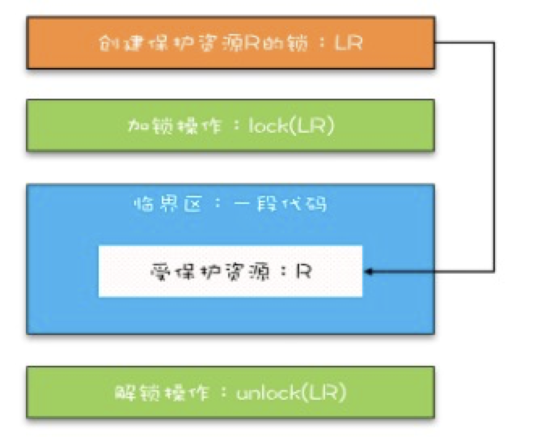

#1 并发理论基础

##1 可见性，原子性，有序性问题

####一、 __内存可见性__  
section1_base_theory.Class01.cal_not_thread_safe 详情见这部分代码  
非线程安全的原因是 ，假设A、B线程同时执行，第一次都会各自将count读取到各自cpu缓存  
执行完count+=1后，同时写入内存，这时内存是1，而非期望的2，所以最终count是小于期望值的
  
  
####二、 __线程切换带来的原子性问题__  
线程是有时间片概念的，而且一条高级语言往往是多条cpu指令完成  
例如count+=1  
指令 1：首先，需要把变量 count 从内存加载到 CPU 的寄存器；  
指令 2：之后，在寄存器中执行 +1 操作；  
指令 3：最后，将结果写入内存（缓存机制导致可能写入的是 CPU 缓存而不是内存）  
这就是原子性的问题

####三、 __编译优化带来的有序性问题__  
例如java的单例问题  
section1_base_theory.Class01 提供了各种单例实现


    
##2 JAVA 如何解决可见性和有序性问题  
Java 内存模型是个很复杂的规范 。本质上可以理解为，Java 内存模型规范了 JVM 如何提供按需禁用缓存和编译优化的方法。  
具体来说，这些方法包括 volatile、synchronized 和 final 三个关键字，以及六项 Happens-Before 规则  

1.5版本后，通过happens-before规则对volatile语义进行了增强    

#####一、 __程序顺序性__
按照程序顺序，前面的操作 Happens-Before 于后续的任意操作  
```java
class VolatileExample {
  int x = 0;
  volatile boolean v = false;
  public void writer() {
    x = 42;
    v = true;
  }
  public void reader() {
    if (v == true) {
      // 如果先执行writer 再 reader 1.5以前是0 以后按照happens-before就是42了
    }
  }
}
```  

#####二、 __volatile变量规则__
对一个volatile变量， 他的写操作 happens-before 读操作  
volatile周围的普通字段不能随便重排；  
编译器生成字节码时，会在volatile写操作的前面和后面分别插入内存屏障（StoreStore屏障｜volatile写｜StoreLoad屏障），  
其中StoreStore屏障：禁止上面的普通写和下面的volatile写重排序；  
StoreLoad屏障：防止上面的volatile写与下面可能有的volatile读/写重排序  

#####三、 __传递性__  
A happen-before B && B happen-before C===》 A happen-before C  
例如上面代码实力中国呢 x = 42 happen-before v = true  
如果B 读到了 v= true 那么一定读到 x = 42

#####四、 __管程中锁的规则__  
其实就是Java 对于 synchronized的实现  
解锁happens-before 后续的加锁操作
```` java
synchronzied (this) { // 此处自动加锁
    // x是共享变量 初始10
    if (this.x < 12) {
        this.x = 12;
    }
} // 此处自动解锁
````

#####五、 __线程 start() 规则__  
主线程A启动 子线程B后， B能看到主线程启动B之前的操作  
即如果A 调用 B的start方法， 那么start() 操作 happen-before B的任何操作
```` java
   Thread B = new Thread(() -> {
           // 主线程调用b.start() 之前，对共享变量对操作都可见 例如var=777
    });
    int var = 777;
    B.start();
````

#####六、 __线程 join() 规则__
线程A调用 B的join并返回，那么B中任何操作 happens-before join的返回
``` java
Thread B = new Thread(() -> {
    int var = 666;
});
//
B.start();
B.join();
```

##3 JAVA 互斥锁   
原子性问题的源头是线程切换问题， 保证"同一时刻只有一个线程执行" 是保证原子性的关键，称为互斥  


java提供的锁技术： synchronzied  
可以修饰方法、代码块
```` java
class X {
    synchronzied void foo() {
        // 临界区
        // 修饰非静态方法 等价于 
        // synchronzied(this) void foo()
    }
    //修饰静态
    synchronized static void bar() {
        //   注意 synchronzied修饰静态方法时，锁定的是类对象
        // 这里等价于 synchronzied (X.class) static void bar()
    }

    // 修饰代码块
    Object obj = new Object();
    void baz() {
        synchronzied(obj) {
        }
    }
}
```` 

关于synchronzied的一个问题， 下面这段代码是否能解决原子性和可见性问题  
```` java
// ***
// 这段代码是不行的
// 加锁本质就是在锁对象的对象头中写入当前线程id，
// 但是new object每次在内存中都是新对象，所以加锁无效。 
// 经过JVM逃逸分析的优化后，这个sync代码直接会被优化掉，
// 所以在运行时该代码块是无锁的
class SafeCalc {
  long value = 0L;
  long get() {
    synchronized (new Object()) {
      return value;
    }
  }
  void addOne() {
    synchronized (new Object()) {
      value += 1;
    }
  }
}
````  
 