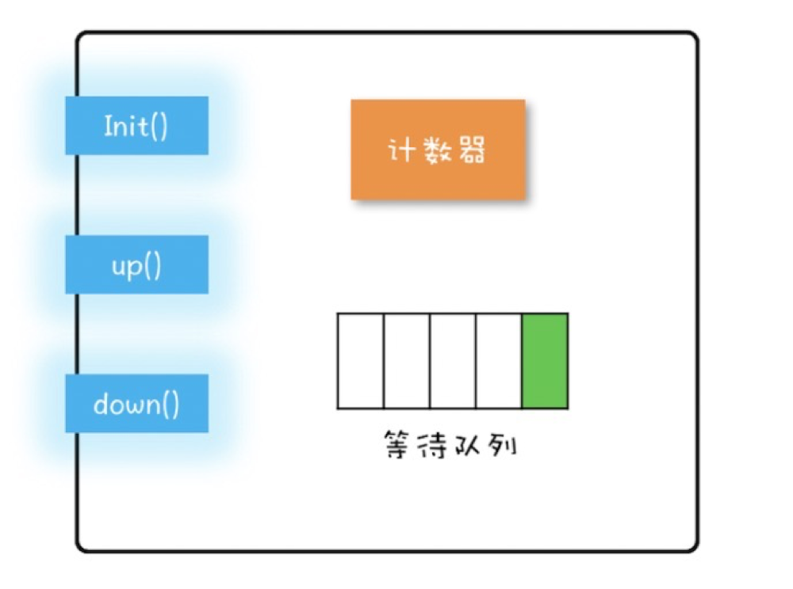

#1 信号量模型
一个信号量模型可以简单由三块组成： 计数器 + 等待队列 + 三个方法（init() down() up())  
  
init() : 设置计数器初始值  
down() : 计数器减1，小于0则阻塞线程
up()   : 计数器+ 1，<= 0 唤醒线程
```java
class Semaphore {
    int count; // 计数器
    Queue queue; // 等待队列
    
    // 初始化
    Semaphore(int c) {
        this.count = c;
    }
    
    void down() {
        this.count--;
        if (this.count < 0) {
            // 当前线程插入等待队列
            // 阻塞当前线程
        }
    }
    
    void up() {
        this.count++;
        if (this.count <= 0) {
            // 移除某个等待队列的线程T
            // 唤醒线程T
        }
    }
    
    // 在java sdk中 up->accquire()  down-->release()

}
```

使用范例  
```java
class SemaphoreTest {
    static int count;
    static final Semaphore s = new Semaphore(1);
    
    // 如果两个线程同时访问addOne() 由于acquire是原子操作，只能有一个将计数器减到0
    // 所以只会有一个线程进入临界区执行count++
    static void addOne() {
        s.acquire();
        try {
            count++;
        } finally{
            s.release();
        }
    }
}
```

Semaphore相对于Lock 还有一个好处，是可以允许多个线程访问一个临界区  
例如线程池、数据库连接池等技术
 
```java
class ObjPool<T, R> {
    final List<T> pool;
    
    // 信号量实现限流器
    final Semaphore sem;    

    ObjPool(int size, T t) {
        // 注意这里， semaphore是允许多线程访问的，所以list必须也要是线程安全的，否则会出线程问题
        //  例如换成arrayList就不行
        pool = new Vector<T>() {};
        for (int i = 0; i < size; i++ ) {
            pool.add(t);
        }
        sem = new Semaphore(size);
    }
    
    // 利用对象池对象调用func
    R exec(Function<T, R> func) {
        T t = null;
        sem.accquire();
        try {
            t = pool.remove(0);
            return func.apply(t);
        }   finally{
            pool.add(t);
            sem.release();
        }
    }
}
```
如果size 是10，那么前10个线程都可以调用acqure（） 继续执行  
其他则会阻塞  
执行完回调函数后，进行释放